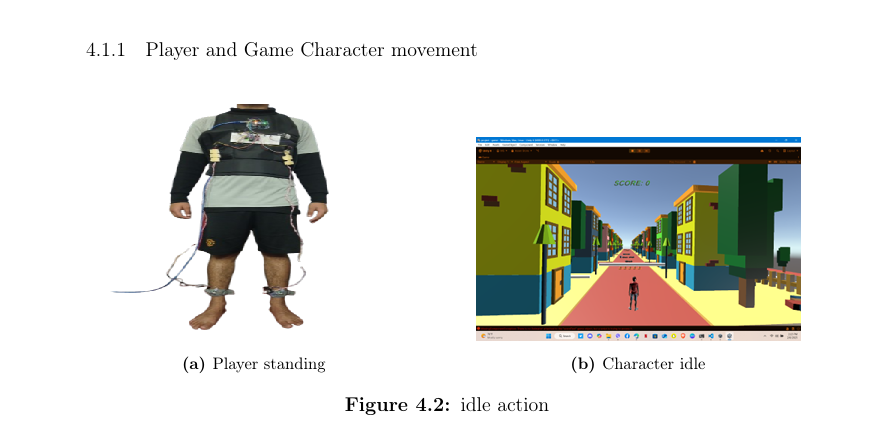
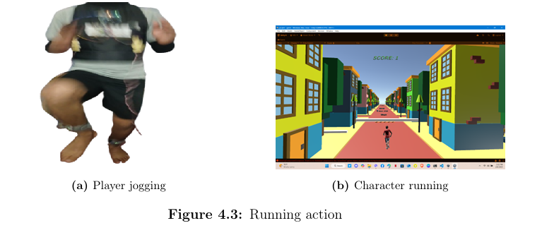
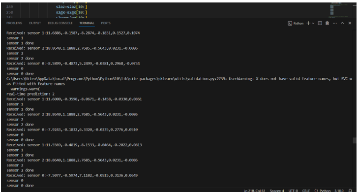

### 🎮FitPlay - Human Activity Recognition Using Machine Learning and mpu_6050 Sensors

> FitPlay is an interactive exergame that uses real-time human activity recognition (HAR) to create an immersive fitness gaming experience. The game encourages physical exercise by mimicking activities such as jogging, squatting, jumping, and standing, using data from wearable motion sensors i.e. mpu_6050.
---

## 📸 Game Preview
**FitPlay** combines motion sensing and machine learning to create an engaging fitness game. By performing real-world actions like jumping, squatting, or jogging, players control an in-game avatar—promoting health while having fun.

   

---

## 🖼️ System Architecture
# How it works?
The sensors capture 6-axis motion data (accelerometer + gyroscope).

Data is classified in real-time using an SVM model.

The game responds to classified actions—jump, squat, run—triggering the in-game avatar.


---

## 🧰 Tech Stack

| Component | Tool |
|----------|------|
| Hardware | MPU6050 Sensors ×3 (Chest, Left Ankle, Right Ankle), Microcontroller, USB HID |
| Software | Unity (Game Engine), Python (HAR Model), SVM (scikit-learn), Serial Communication |
| Model    | SVM Classifier with 80% accuracy for 4-class activity recognition |

---

## 🦾 Activities Recognized

- 🏃‍♂️ Jogging  
- 🧍 Standing  
- 🏋️ Squatting  
- 🕴️ Jumping  

---

## 👣 Sensor Placement


> 3 MPU6050 sensors: one on the chest and one on each ankle.

---

## 📊 Classification Visualization



---

## 🔧 Setup Instructions

```bash
# Install dependencies
pip install pandas numpy matplotlib scikit-learn pyserial
